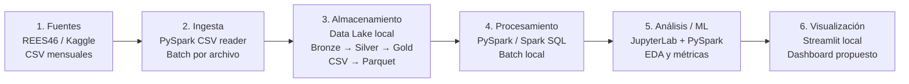

# Diseño arquitectónico — proyecto eCommerce Big Data

## Problema de negocio

El e-commerce quiere entender cómo convertir más visitas a productos en compras. El análisis se limita a octubre y noviembre de 2019, los dos meses presentes localmente.

### Preguntas y decisiones

| Pregunta | Decisión que permite orientar |
|---|---|
| ¿Qué proporción de sesiones pasa de ver productos a agregarlos al carrito y luego comprarlos? | Identificar el paso del recorrido en el que conviene investigar mejoras. El funnel requiere `user_session` y timestamps válidos. |
| ¿Qué categorías concentran más compras y mayor valor estimado de compra? | Priorizar categorías para merchandising/promociones y revisar faltantes de `category_code`. La suma de `price` en eventos `purchase` es solo una aproximación, no margen ni ventas netas. |
| ¿En qué días y horas se registran más compras y mejor conversión? | Proponer horarios para campañas y validarlos con periodos adicionales. El tiempo se agrupa en UTC. |

## Almacenamiento: Data Lake local

Se recomienda un **Data Lake en el sistema de archivos local**, organizado con zonas Medallion. `data/raw/` contiene los CSV de origen inmutables (Bronze). Para fases posteriores se proponen `data/processed/silver/` con datos limpios/validados en Parquet y `data/processed/gold/` con agregados de negocio en Parquet. En Fase 1 se documenta esta arquitectura; todavía no se genera un pipeline Bronze → Silver → Gold.

| Criterio | Data Warehouse | Data Lake — recomendado | Data Lakehouse |
|---|---|---|---|
| **Datos** | Tablas curadas y principalmente estructuradas, orientadas a BI. | Conserva los CSV originales y admite resultados curados Parquet. | Combina archivos tipo Lake con tablas transaccionales y curadas. |
| **Esquema** | Schema-on-write: definición previa y rígida de tablas. | Schema-on-read para el origen; se valida el esquema al producir Silver. | Esquema gestionado sobre el Lake, con enforcement/evolución según el formato. |
| **Costo** | Puede exigir un motor o servicio dedicado. | Bajo para este alcance: disco local y Spark open source. | Mayor configuración y componentes que el Lake simple. |
| **Rendimiento** | Alto para consultas BI repetitivas sobre tablas modeladas. | Adecuado para exploración y procesamiento Batch con Spark; Parquet se plantea para las zonas curadas. | Añade transacciones y concurrencia para tablas compartidas/grandes. |
| **Usuarios** | Analistas BI y usuarios de negocio. | Equipo de datos; Gold puede alimentar análisis/BI. | Analistas y perfiles ML sobre un stack común. |
| **Gobernanza** | Esquemas y controles centralizados. | Requiere convenciones de carpetas, validaciones y permisos del filesystem. | Puede aportar ACID, evolución de esquema y versionado según Delta/Iceberg/Hudi. |

El Warehouse no es la mejor capa primaria para conservar y explorar los CSV originales. El Lakehouse aportaría capacidades ACID/versionado que no son necesarias para un análisis local de dos meses; añadir Delta Lake o Iceberg ahora elevaría la complejidad sin un requisito operativo que lo justifique.

## Procesamiento: ELT y Batch

### ELT

Se recomienda **ELT**: conservar primero los archivos originales en Bronze y transformar con Spark al producir Silver y Gold. Esto mantiene una fuente reproducible y permite corregir reglas sin sobrescribir los datos descargados. Aunque el EDA valida campos, no escribe todavía esas capas transformadas.

### Batch frente a Streaming, Lambda y Kappa

| Patrón | Aplicación al caso |
|---|---|
| **Batch — seleccionado** | Ejecutar PySpark cuando se descargue o actualice un archivo mensual. Los datos presentes son CSV históricos y el EDA es por lotes. |
| **Streaming** | No se propone como modo principal: no existe en el alcance una fuente operacional que entregue eventos en vivo. `event_time` permite agrupar el historial, pero no acredita una tasa actual de llegada. |
| **Lambda** | No se recomienda: mantendría rutas separadas de Batch y Streaming para un problema que solo tiene datos batch, duplicando lógica y operación. |
| **Kappa** | No se recomienda: exige que el flujo entero sea de eventos continuos; contradice los archivos históricos disponibles. |

Kafka, Hadoop, Docker, Airflow y servicios cloud no son necesarios para esta arquitectura local de Fase 1. La guía exige Spark porque cada CSV tiene más de 10 millones de filas; no se afirma que una base relacional bien dimensionada sea incapaz de almacenar el subconjunto.

## Arquitectura de seis capas

| Capa | Tecnología específica | Frecuencia | Justificación |
|---|---|---|---|
| **1. Fuentes** | CSV mensuales de `eCommerce behavior data from multi category store` de REES46/Kaggle | Histórica; archivos octubre y noviembre disponibles | Es el origen descargado y verificable del análisis. |
| **2. Ingesta** | Lector CSV de PySpark | Batch al incorporar/actualizar un archivo mensual | Lee columnas y tipos bajo un esquema controlado y cumple la regla Spark del curso. |
| **3. Almacenamiento** | Sistema de archivos local; `data/raw/` como Bronze, `data/processed/silver/` y `data/processed/gold/` propuestos; Parquet para curados | Persistente; se añade una carga por archivo | Evita copias en cloud, conserva el raw inmutable y define cómo organizar resultados futuros. |
| **4. Procesamiento** | PySpark / Spark SQL en modo local | Batch, bajo demanda al llegar un archivo | Procesa los volúmenes observados en el equipo disponible y permite agregar sin cargar todo el CSV en Pandas. |
| **5. Análisis/ML** | JupyterLab + PySpark; Matplotlib para gráficos exploratorios | Durante el EDA y análisis bajo demanda | El notebook lee agregados compactos. No se propone un modelo ML antes de establecer su pertinencia con los resultados. |
| **6. Visualización** | Streamlit local | Actualización posterior al refresco de Gold, si se implementa | Tecnología propuesta para el dashboard de una fase posterior; no se implementa en Fase 1. |

El lote se ejecutaría manualmente al recibir cada archivo mensual; no se diseña una ejecución continua ni un SLA de streaming. Las zonas Silver/Gold, Parquet y Streamlit están propuestas, no construidas como pipeline/producto en esta fase.

## Evidencia y límites

El EDA calculó 109.950.743 filas y 13,668 GiB sin comprimir para los dos meses locales. El detalle de calidad, funnel y métricas está en [`analisis_exploratorio_fase1.md`](analisis_exploratorio_fase1.md) y `data/output/eda_summary.json`. La guía académica está en [`proyecto_final_big_data_2.md`](proyecto_final_big_data_2.md).

Las decisiones comerciales son hipótesis a validar. No hay datos de órdenes contables, margen, inventario, costos, campañas ni tráfico en vivo. La tasa de `price` en compras es una suma de eventos, y las comparaciones temporales se limitan a dos meses en UTC.
